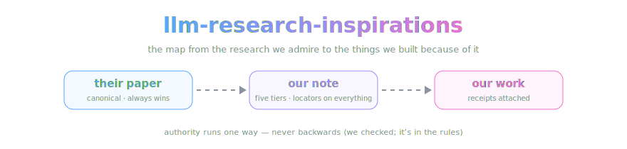

<div align="center">



*The map from the research we admire to the things we built because of it.*

[](LICENSE.md)


</div>

> **The recognition layer.** Every entry names a paper, the OpenCnid repo or
> feature it shaped, and why — with receipts. If we can't point at a commit, a
> design doc, or a shipped feature that exists because of a paper, the paper
> doesn't get an entry. Admiration is free; entries are earned.

**This repo holds interpretations, on purpose.** The facts live in each
paper's own repo — every paper we study gets one, named after the paper so the
people searching for the research can find it, starting with
[chain-of-density](https://github.com/OpenCnid/chain-of-density) — and the
papers themselves outrank everything. Authority runs one direction —
**paper → note → entry** — so nothing here is ever evidence for anything
except what *we* did about it.

## Entry format

Bracketed names are generation instructions, not literal text; write each entry
into this frame.

```markdown
## {Paper_Title} — {Lab_Or_First_Author_And_Year}

- **paper:** {Canonical_Link_With_Pinned_Version}
- **our note:** {Link_To_The_Note_In_The_Papers_Own_Repo}
- **what it shaped:** {OpenCnid_Repo_Or_Feature_Link}
- **the receipt:** {Commit_PR_Design_Doc_Or_Shipped_Feature_That_Exists_Because_Of_It}

{Two_To_Four_Sentences_On_What_The_Paper_Changed_In_Our_Work_Specific_And_Grateful_Without_Hype}
```

## House rules

- **Receipts or it didn't happen.** An influence claim links to the artifact it
  influenced. "This shaped our thinking" with nothing attached is a tweet, not
  an entry.
- **No implied endorsement.** Being inspired by a lab's work does not mean that
  lab knows we exist, let alone approves of what we built with it. We say this
  once here so no entry has to.
- **Their science, our reading.** If an entry misstates a finding, the fix goes
  in source-first: correct the note in the paper's repo, then the entry here.
  Open an issue; corrections are the fastest PRs we merge.
- **Gratitude, not marketing.** Entries say what changed in our work, not how
  great we are for having read a paper.

## The entries

*(Four so far. Rome, a day — you know how this goes.)*

## From Sparse to Dense: GPT-4 Summarization with Chain of Density Prompting — Adams et al., 2023

- **paper:** [arXiv:2309.04269](https://arxiv.org/abs/2309.04269) (pinned v1, 2023-09-08) · [published version](https://aclanthology.org/2023.newsum-1.7/)
- **our note:** [chain-of-density / density-chain.md](https://github.com/OpenCnid/chain-of-density/blob/main/density-chain.md)
- **what it shaped:** [chain-of-density](https://github.com/OpenCnid/chain-of-density) — the repo itself, and the note format every paper repo after it will use
- **the receipt:** [METHOD.md](https://github.com/OpenCnid/chain-of-density/blob/main/METHOD.md) and the five-tier structure of the note

This paper is why our paper repos look the way they do. Its
fixed-length constraint became the engine of our note format — without it,
"add detail" makes summaries longer, never denser. Its human-preference result
(median preferred step three, not five) is why we keep every tier instead of
shipping only the densest, and its low annotator agreement (Fleiss' κ = 0.112)
is why the reader, not the writer, picks the tier. We adapted rather than
adopted: ~150-word tiers instead of ~70, entities broadened to ablations and
limitations, and a locator citation on every claim.

## Polymorphic Combinatorial Frameworks (PCF) — Pearl, Murphy & Intriligator, 2025

- **paper:** [arXiv:2508.01581](https://arxiv.org/abs/2508.01581) (pinned v1, 2025-08-03)
- **our note:** [pcf-adaptive-agents / density-chain.md](https://github.com/OpenCnid/pcf-adaptive-agents/blob/main/density-chain.md)
- **what it shaped:** the structural-prompting and hypershot protocols our authoring pipeline mandates — reaching us through co-author Matthew Murphy's Lexideck curriculum, of which PCF is the peer-reviewed formalization
- **the receipt:** the [density-chain skill](https://github.com/OpenCnid/chain-of-density/blob/main/.claude/skills/density-chain/SKILL.md) and the [batch handoff prompt](https://github.com/OpenCnid/chain-of-density/blob/main/prompts/batch-run-handoff.md), both of which instruct every authoring session to load those protocols before writing a word

Full disclosure first: [Matthew Murphy](https://github.com/gusthemole) is a
friend of the lab and a collaborator on our current project, and the
influence here predates the paper. His Lexideck prompt-engineering
curriculum is the direct ancestor of the structural-prompting and hypershot
protocols wired into our harness — our methodology repo literally instructs
every authoring session to load them before writing a word. PCF is that line
of work grown up and peer-reviewed: topos theory doing formally what our
templates enforce by convention. We'd have studied this paper anyway;
knowing an author just means we say so.

## Emotion Concepts and their Function in a Large Language Model — Sofroniew et al. (Anthropic), 2026

- **paper:** [Transformer Circuits Thread](https://transformer-circuits.pub/2026/emotions/index.html) (published 2026-04-02) · [arXiv:2604.07729](https://arxiv.org/abs/2604.07729) (pinned v1, 2026-04-09)
- **our note:** [emotion-concepts-in-llms / density-chain.md](https://github.com/OpenCnid/emotion-concepts-in-llms/blob/main/density-chain.md)
- **what it shaped:** the residual-stream sidecar direction in [Trellis](https://github.com/OpenCnid/trellis) — activation-level monitoring as a first-class future project
- **the receipt:** [RESIDUAL_STREAM_SIDECAR.md](https://github.com/OpenCnid/trellis/blob/master/docs/architecture/RESIDUAL_STREAM_SIDECAR.md), the ratified design record built on this paper's findings

This paper turned "models under pressure do bad things" into an instrument
reading: emotion concepts are linear, causal, dose-responsive directions, and
turning the desperation dial moves blackmail and reward-hacking rates. Our
sidecar design record exists because of that chain — its foundations section
walks the paper's findings one by one, and its monitoring ambitions grow from
the paper's own suggestion to watch for extreme activations. The authors'
claim that the methodology is not emotion-specific is the extrapolation our
sidecar bet rides on; our records mark it as extrapolated, not measured,
which is exactly the honesty this paper models.

## Who Grades the Grader? Co-Evolving Evaluation Metrics and Skills for Self-Improving LLM Agents — Zhang et al., 2026

- **paper:** [arXiv:2607.12790](https://arxiv.org/abs/2607.12790) (pinned v1, 2026-07-14)
- **our note:** [who-grades-the-grader-pdf / density-chain.md](https://github.com/OpenCnid/who-grades-the-grader-pdf/blob/main/density-chain.md)
- **what it shaped:** the judge-harness program in [Trellis](https://github.com/OpenCnid/trellis) — the epistemic-support layer's composable-rubrics direction, and its anchor-first safety doctrine
- **the receipt:** [COMPOSABLE_RUBRICS_DESIGN.md](https://github.com/OpenCnid/trellis/blob/master/docs/product/epistemic-support/COMPOSABLE_RUBRICS_DESIGN.md), a design record that exists to reconstruct this paper's rubric-and-outcome machinery, with the paper registered as source S1 in [RESEARCH_MAP.md](https://github.com/OpenCnid/trellis/blob/master/docs/product/epistemic-support/RESEARCH_MAP.md)

The nearest prior art to our judge-harness program, published days before we
read it. Its ablation result — anchor discipline is the load-bearing safety
guard for evolved evaluators, while lifecycle hygiene buys efficiency —
validated the calibration-anchor doctrine our judging architecture was
already organized around, and its typed drawback detectors are the raw
material our composable-rubrics design sets out to reconstruct. Its Goodhart
episode (metric gamed, outside judge catches it, one detector repairs it,
then the judge itself needs auditing) is the failure-expecting posture we
want our own panels held to.

## License

[CC BY 4.0](LICENSE.md) © OpenCnid Labs.

---

<div align="center">
<sub>The entries are earned. The jokes are free.</sub>
</div>
