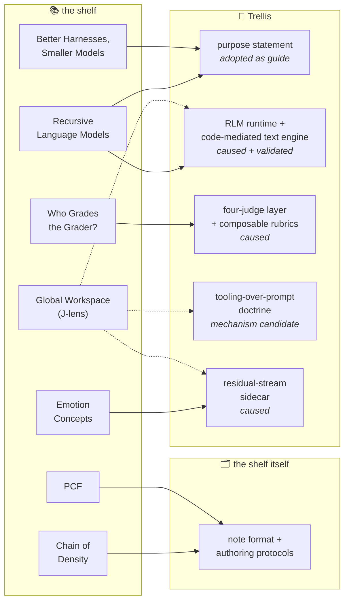

<div align="center">


*The map from the research we admire to the things we built because of it.*

[](LICENSE.md)


</div>

> **The recognition layer.** Every entry names a paper, the OpenCnid repo or
> feature it shaped, and why — with receipts. If we can't point at a commit, a
> design doc, or a shipped feature that exists because of a paper, the paper
> doesn't get an entry. Admiration is free; entries are earned.

**This repo holds interpretations, on purpose.** The facts live in each
paper's own repo — every paper we study gets one, named after the paper so the
people searching for the research can find it, starting with
[chain-of-density](https://github.com/OpenCnid/chain-of-density) — and the
papers themselves outrank everything. Authority runs one direction —
**paper → note → entry** — so nothing here is ever evidence for anything
except what *we* did about it.

## Entry format

Bracketed names are generation instructions, not literal text; write each entry
into this frame.

```markdown
## {Paper_Title} — {Lab_Or_First_Author_And_Year}

- **paper:** {Canonical_Link_With_Pinned_Version}
- **our note:** {Link_To_The_Note_In_The_Papers_Own_Repo}
- **what it shaped:** {OpenCnid_Repo_Or_Feature_Link}
- **the receipt:** {Commit_PR_Design_Doc_Or_Shipped_Feature_That_Exists_Because_Of_It}

{What_The_Paper_Changed_In_Our_Work_Specific_And_Grateful_Without_Hype}
```

## House rules

- **Receipts or it didn't happen.** An influence claim links to the artifact it
  influenced. "This shaped our thinking" with nothing attached is a tweet, not
  an entry.
- **No implied endorsement.** Being inspired by a lab's work does not mean that
  lab knows we exist, let alone approves of what we built with it. We say this
  once here so no entry has to.
- **Their science, our reading.** If an entry misstates a finding, the fix goes
  in source-first: correct the note in the paper's repo, then the entry here.
  Open an issue; corrections are the fastest PRs we merge.
- **Gratitude, not marketing.** Entries say what changed in our work, not how
  great we are for having read a paper.
- **Influence comes in kinds, and we label them.** *Caused* means the artifact
  exists because of the paper. *Adopted as guide* means the owner ratified the
  paper as a framing for the program. *Validated* means the paper confirmed a
  decision we had already made and measured — flattering, but not causation.
  *Avenue* means the paper opened a direction we registered but have not
  built. Entries below say which kind they claim, because an influence map
  that can't tell validation from causation is a hype document with citations.

## How the shelf maps onto Trellis

Our current project is **[Trellis](https://github.com/OpenCnid/trellis)**. Its
purpose statement, in the owner's framing (recorded in the repo's
[HANDOFF](https://github.com/OpenCnid/trellis/blob/master/HANDOFF.md)):
*Trellis = RLM depth × the best, most adaptive harness, with
uncertainty-around-facts managed by an adaptive four-judge layer.* Unpacked,
that is four load-bearing pieces, and each paper on this shelf attaches to at
least one:

- **The engine** — a Recursive Language Model runtime (the MIT CSAIL
  formulation) over a code-mediated text substrate
  ([ARCHITECTURE.md](https://github.com/OpenCnid/trellis/blob/master/docs/architecture/ARCHITECTURE.md),
  [CODE_MEDIATED_TEXT.md](https://github.com/OpenCnid/trellis/blob/master/docs/architecture/CODE_MEDIATED_TEXT.md)):
  the prompt and working state live in a REPL environment the model
  programmatically walks — the model never counts and never copies;
  addresses are engine-computed, splices are hash-guarded. The design bet is
  that externalizing state into the harness beats holding it in attention.
- **The harness** — the adaptive scaffolding around the model: tools,
  budgets, typed refusals, deterministic guards. House doctrine, measured
  before it was doctrine: *tooling shape enforces; prompts reinforce* —
  failure classes get closed in the harness, not begged away in the prompt.
- **The judge layer** — the epistemic-support program
  ([EPISTEMIC_SUPPORT.md](https://github.com/OpenCnid/trellis/blob/master/docs/architecture/EPISTEMIC_SUPPORT.md),
  [FOUR_JUDGE_DESIGN.md](https://github.com/OpenCnid/trellis/blob/master/docs/product/epistemic-support/FOUR_JUDGE_DESIGN.md)):
  four-role panels (grounding, coherence, corroboration, audit) that grade
  claims against anchored references, with composable rubrics and a
  research register ([RESEARCH_MAP.md](https://github.com/OpenCnid/trellis/blob/master/docs/product/epistemic-support/RESEARCH_MAP.md))
  that tracks every source and what standing its claims have.
- **The sidecar** — a ratified future project
  ([RESIDUAL_STREAM_SIDECAR.md](https://github.com/OpenCnid/trellis/blob/master/docs/architecture/RESIDUAL_STREAM_SIDECAR.md)):
  reading the model's residual stream during operation, so the judge layer
  can consult what the model's activations say alongside what its text says.

The shelf, mapped:



Read as a whole, the shelf divides one problem among five papers. The RLM
paper supplies *the substrate* — the prompt as environment, walked with code,
recursed over programmatically — and everything else wraps it. The harness
paper says *where capability should live* (lift shared difficulty out of the
model); the grader paper says *how to trust the thing that scores it*
(anchor the metric, audit from outside); the two interpretability papers say
*what the model is doing underneath* (a small verbalizable workspace does
the flexible reasoning, and concept-level directions in it causally steer
behavior). Trellis is one wager on all five at once: an RLM engine that
externalizes state (which the workspace paper's own externalization result
independently supports), a harness that closes failure classes structurally
(which the dissociation result gives a mechanism for), a judge layer built
the way the grader paper says graders survive (anchors it must predict,
anchors it never sees, an outside audit), and a sidecar that wants to
instrument the representations the interpretability papers found. The mechinterp half of the
shelf also rides one shared, explicitly-marked empirical bet: that
concept-level structure in the residual stream is decomposable and stable
enough to instrument. Our register keeps that marked as extrapolation until
we measure it — testing the bet is part of the program, not a footnote to it.

## The entries

*(Seven so far. Rome, a day — you know how this goes.)*

## From Sparse to Dense: GPT-4 Summarization with Chain of Density Prompting — Adams et al., 2023

- **paper:** [arXiv:2309.04269](https://arxiv.org/abs/2309.04269) (pinned v1, 2023-09-08) · [published version](https://aclanthology.org/2023.newsum-1.7/)
- **our note:** [chain-of-density / density-chain.md](https://github.com/OpenCnid/chain-of-density/blob/main/density-chain.md)
- **what it shaped:** [chain-of-density](https://github.com/OpenCnid/chain-of-density) — the repo itself, and the note format every paper repo after it uses
- **the receipt:** [METHOD.md](https://github.com/OpenCnid/chain-of-density/blob/main/METHOD.md) and the five-tier structure of the note
- **kind of influence:** caused

This paper is why our paper repos look the way they do. Its
fixed-length constraint became the engine of our note format — without it,
"add detail" makes summaries longer, never denser. Its human-preference result
(median preferred step three, not five) is why we keep every tier instead of
shipping only the densest, and its low annotator agreement (Fleiss' κ = 0.112)
is why the reader, not the writer, picks the tier. We adapted rather than
adopted: ~150-word tiers instead of ~70, entities broadened to ablations and
limitations, and a locator citation on every claim.

## Polymorphic Combinatorial Frameworks (PCF) — Pearl, Murphy & Intriligator, 2025

- **paper:** [arXiv:2508.01581](https://arxiv.org/abs/2508.01581) (pinned v1, 2025-08-03)
- **our note:** [pcf-adaptive-agents / density-chain.md](https://github.com/OpenCnid/pcf-adaptive-agents/blob/main/density-chain.md)
- **what it shaped:** the structural-prompting and hypershot protocols our authoring pipeline mandates — reaching us through co-author Matthew Murphy's Lexideck curriculum, of which PCF is the peer-reviewed formalization
- **the receipt:** the [density-chain skill](https://github.com/OpenCnid/chain-of-density/blob/main/.claude/skills/density-chain/SKILL.md) and the [batch handoff prompt](https://github.com/OpenCnid/chain-of-density/blob/main/prompts/batch-run-handoff.md), both of which instruct every authoring session to load those protocols before writing a word
- **kind of influence:** caused (via the curriculum lineage)

Full disclosure first: [Matthew Murphy](https://github.com/gusthemole) is a
friend of the lab and a collaborator on our current project, and the
influence here predates the paper. His Lexideck prompt-engineering
curriculum is the direct ancestor of the structural-prompting and hypershot
protocols wired into our harness — our methodology repo literally instructs
every authoring session to load them before writing a word. PCF is that line
of work grown up and peer-reviewed: topos theory doing formally what our
templates enforce by convention. We'd have studied this paper anyway;
knowing an author just means we say so.

## Recursive Language Models — Zhang, Kraska & Khattab (MIT CSAIL), 2025

- **paper:** [arXiv:2512.24601](https://arxiv.org/abs/2512.24601) (pinned v3, 2026-05-11; v1 2025-12-31) · [authors' code](https://github.com/alexzhang13/rlm)
- **our note:** [recursive-language-models / density-chain.md](https://github.com/OpenCnid/recursive-language-models/blob/main/density-chain.md)
- **what it shaped:** [Trellis](https://github.com/OpenCnid/trellis), whole — the runtime *is* this formulation, implemented
- **the receipt:** the root statement of [ARCHITECTURE.md](https://github.com/OpenCnid/trellis/blob/master/docs/architecture/ARCHITECTURE.md) ("Trellis as a Recursive Language Model runtime" is the root), the [GLOSSARY](https://github.com/OpenCnid/trellis/blob/master/docs/GLOSSARY.md) entry that defines "RLM" by pointing at this paper, Axiom 1′ of [WORKSPACE_AND_MODULES.md](https://github.com/OpenCnid/trellis/blob/master/docs/architecture/WORKSPACE_AND_MODULES.md), and the "RLM depth" half of the HANDOFF purpose statement
- **kind of influence:** caused — the deepest receipt possible: the project is the implementation

Every other entry on this shelf shaped a component; this paper shaped the
noun. A Recursive Language Model treats the prompt as an external environment
— a variable in a persistent REPL that the model walks with code, calling
itself recursively over programmatic slices — while presenting an ordinary
string-in, string-out interface. Trellis is that inversion built out as a
runtime: the reasoning engine is an RLM by name, our glossary's definition of
the term is a citation to this paper, and our test-time-training doctrine
file lists it as reference number one with the annotation that everything
else would live *under* it.

**In Trellis, specifically:**

- **The engine is the formulation.** [FLYWHEEL_EXPLAINER.md](https://github.com/OpenCnid/trellis/blob/master/docs/benchmarks/FLYWHEEL_EXPLAINER.md)
  opens by defining the MIT CSAIL RLM — a model given a Python REPL and
  `llm_query()` self-calls, chunking and fanning out over corpora too large
  for one window — because that is the machine whose economics the flywheel
  measures. Our benchmarking runs
  [OOLONG-Pairs](https://github.com/OpenCnid/trellis/blob/master/docs/benchmarks/OOLONG_BENCHMARK_REPORT.md),
  the pairwise-aggregation task from this paper's own evaluation line, against
  our runtime.
- **Code-mediated text is the inversion, hardened.** The paper's key design
  choice — the prompt never enters the context window; the model gets a
  symbolic handle and builds intermediate values in variables — is what our
  [CODE_MEDIATED_TEXT.md](https://github.com/OpenCnid/trellis/blob/master/docs/architecture/CODE_MEDIATED_TEXT.md)
  pillar turns into enforced law: the model never counts, never copies;
  addresses are engine-computed; splices are hash-guarded. The paper supplies
  the paradigm; the pillar supplies the guardrails the paper's §7 says are
  underexplored.
- **The findings we operate by.** Depth-0 already beating agent scaffolds
  (the REPL is load-bearing; recursion is a multiplier), the
  first-decomposition effect, and syntax errors compounding through sub-call
  depth — our note flags all three as production advice, and the last one is
  a standing argument for our engine owning structure instead of trusting
  model-written string manipulation.
- **The lineage runs through the whole map.** The purpose statement reads
  "Trellis = RLM depth × the best, most adaptive harness" — this paper is
  the first factor, the harness paper (next entry) the second, and the
  workspace paper's externalization result (two entries down) later provided
  independent mechanistic support for why prompt-as-environment works at
  all. One substrate, externally corroborated, economically framed, judged
  from outside: that's the shelf in one sentence.

## Better Harnesses, Smaller Models: Building 90% Cheaper Agents via Automated Harness Adaptation — Yang, Zhao, Wu & Kästner (CMU), 2026

- **paper:** [arXiv:2607.08938](https://arxiv.org/abs/2607.08938) (pinned v1, 2026-07-09)
- **our note:** [better-harnesses-smaller-models / density-chain.md](https://github.com/OpenCnid/better-harnesses-smaller-models/blob/main/density-chain.md)
- **what it shaped:** the purpose framing of [Trellis](https://github.com/OpenCnid/trellis) itself — owner-adopted, July 16, 2026, as the program's purpose-level guide
- **the receipt:** the purpose statement in [HANDOFF.md](https://github.com/OpenCnid/trellis/blob/master/HANDOFF.md) ("Trellis = RLM depth × the best, most adaptive harness (S9), with uncertainty-around-facts managed by the adaptive four-judge layer" — S9 is this paper's register ID) and register row R-25 in [RESEARCH_MAP.md](https://github.com/OpenCnid/trellis/blob/master/docs/product/epistemic-support/RESEARCH_MAP.md)
- **kind of influence:** adopted as guide; validated the pre-existing tooling doctrine

We read the full text on July 16, 2026, primary-verified it the same day,
and the owner designated it the program's purpose-level guide — the only
paper on this shelf that names the whole project's shape rather than one
component's. Its core claim, that much of agent task difficulty is shared
across instances and can be lifted from the model into the harness, is the
economic generalization of two things Trellis had already measured locally:
the tooling-shape doctrine (failure classes close in the harness, not in the
prompt) and externalization (the harness carries what attention would
otherwise hold). Difficulty lifted once into the harness is amortized across
every future instance — which is the flywheel's cost logic applied to
capability itself.

**In Trellis, specifically:**

- The **purpose statement** in HANDOFF.md cites this paper by register ID.
  That framing — a deep reasoning substrate wrapped in the most adaptive
  harness we can build — is now the sentence the program steers by.
- The register (R-25) records what was **verified at the primary**: 16/21
  task–SLM pairs significantly improved, 7 gaps closed, best small model at
  89.7% of frontier performance for 4% of the cost, dominant fixes being
  added contexts (86%) and created tools (43%) — numbers we checked in the
  paper, not the press release.
- Its automated harness-adaptation loop is deliberately **gated, not
  adopted**: the register notes that a failure-trajectory optimizer is the
  grader paper's metric loop pointed at the harness, so any automated
  adaptation in Trellis enters behind the same acceptance-bound guards
  (anchors and human gates first, AB-8). One paper supplies the ambition;
  the next entry supplies the brakes.
- Honesty about direction: the tooling-over-prompt doctrine **predates**
  this paper (owner ruling, July 11, 2026). The paper arrived five days
  later as its economic generalization at scale — adopted guide and
  validation, not origin.

## Who Grades the Grader? Co-Evolving Evaluation Metrics and Skills for Self-Improving LLM Agents — Zhang et al., 2026

- **paper:** [arXiv:2607.12790](https://arxiv.org/abs/2607.12790) (pinned v1, 2026-07-14)
- **our note:** [who-grades-the-grader / density-chain.md](https://github.com/OpenCnid/who-grades-the-grader/blob/main/density-chain.md)
- **what it shaped:** the judge-harness program in [Trellis](https://github.com/OpenCnid/trellis) — the epistemic-support layer's composable-rubrics direction and its anchor-first safety doctrine
- **the receipt:** [COMPOSABLE_RUBRICS_DESIGN.md](https://github.com/OpenCnid/trellis/blob/master/docs/product/epistemic-support/COMPOSABLE_RUBRICS_DESIGN.md), a design record that exists to reconstruct this paper's rubric-and-outcome machinery, with the paper registered as source S1 in [RESEARCH_MAP.md](https://github.com/OpenCnid/trellis/blob/master/docs/product/epistemic-support/RESEARCH_MAP.md)
- **kind of influence:** caused (the composable-rubrics design record); validated (the anchor doctrine)

The nearest prior art to our judge-harness program, published four days
before we read it, and the paper this shelf would keep if it could keep only
one for the judging work. Trellis's epistemic-support layer needs rubrics
that are numerous, auditable, and cheap to produce correctly — and no
off-the-shelf system exists. This paper is the raw material: its typed
drawback-detector specs, generic and task-aware judge rubrics, per-round
op-pool histories, and outcome data are exactly what our composable-rubrics
design record sets out to reconstruct as engine-side objects with hashes and
anchor sets.

**In Trellis, specifically:**

- **Anchor discipline over lifecycle hygiene.** The paper's ablation showed
  the anchor guards are the load-bearing safety wall for evolved evaluators
  (remove them and the metric collapses into a vacuous always-pass grader on
  three of three seeds), while the detector lifecycle merely buys
  efficiency. Our judging doctrine was already organized around calibration
  anchors and locked references the loops never read; this paper ran the
  ablation we hadn't, and the result landed on our side. Validation, and we
  say so.
- **The outside audit is structural, not optional.** Its Goodhart episode —
  metric gamed via a tag counter, an independent stronger judge catches it,
  one detector repairs it, then the judge itself proves convention-blind and
  needs a task-aware rubric — is the failure-expecting posture our
  four-judge panels are designed for, and
  [FOUR_JUDGE_BASIC_MODEL.md](https://github.com/OpenCnid/trellis/blob/master/docs/product/epistemic-support/FOUR_JUDGE_BASIC_MODEL.md)
  cites the paper's abstention-and-audit architecture directly.
- **Composition over monoliths.** A metric as an inspectable expression tree
  over single-question detectors, rather than one opaque LLM judge, is the
  same shape as our rubric primitives: typed, single-question checks
  composed under guards, diagnosable when they fail.
- **The brakes on the harness paper's ambition.** The register records that
  automated harness adaptation (previous entry) would be this paper's metric
  loop pointed at the harness — so it inherits this paper's guards: an
  anchor the optimizer must predict, an anchor it never sees, and an audit
  standing outside every loop. The two papers entered the program in the
  same week and immediately started supervising each other, which feels
  right.
- The **directional-metric result** — a grader agreeing with ground truth at
  0.500 ± 0.026 still recovering full skill-loop lift, because failure
  capsules carry the teaching — is flagged in our note as the finding we
  most want to replicate before leaning on it. Registered, not yet load-bearing.

## Verbalizable Representations Form a Global Workspace in Language Models — Gurnee et al. (Anthropic), 2026

- **paper:** [Transformer Circuits Thread](https://transformer-circuits.pub/2026/workspace/index.html) (published 2026-07-06; pin = date + URL, articles carry no version number)
- **our note:** [global-workspace-in-llms / density-chain.md](https://github.com/OpenCnid/global-workspace-in-llms/blob/main/density-chain.md)
- **what it shaped:** the evidence base under two already-ratified Trellis commitments — the code-mediated-text pillar and the tooling-over-prompt doctrine — plus a registered future avenue for the sidecar
- **the receipt:** register rows R-20, R-21, R-23, and R-24 in [RESEARCH_MAP.md](https://github.com/OpenCnid/trellis/blob/master/docs/product/epistemic-support/RESEARCH_MAP.md) — the paper was read in full (124 pages) on July 16, 2026, primary-verified, and adjudicated into the register four rows deep — and the workspace-manipulation avenue recorded in [TEST_TIME_TRAINING.md](https://github.com/OpenCnid/trellis/blob/master/docs/architecture/TEST_TIME_TRAINING.md)
- **kind of influence:** validated (strongly); mechanism candidate; avenue registered

The epistemics here matter, so we lead with them: the code-mediated-text
pillar was ratified on July 9, 2026, and this paper was read on July 16 — it
*caused* nothing in the engine. What it did is rarer: it is the strongest
external validation the register has ever recorded for the program's core
thesis, and it handed us a candidate mechanism for a doctrine we had only
measured behaviorally.

**In Trellis, specifically:**

- **Externalization (R-23).** The paper found GSM8K solved with explicit
  chain-of-thought is substantially more robust to workspace ablation than
  the same problems answered directly — the model writing intermediate state
  onto the page instead of carrying it in its capacity-limited internal
  workspace. That is
  [CODE_MEDIATED_TEXT.md](https://github.com/OpenCnid/trellis/blob/master/docs/architecture/CODE_MEDIATED_TEXT.md)'s
  bet stated as a measurement: holding working state in REPL variables and
  engine structures is externalization by construction, and the harness is,
  in the register's phrase, a workspace prosthetic. It converges with our
  own measured effective-context decoupling.
- **The report/automatic dissociation (R-21).** A J-lens swap flips what the
  model *reports* and *flexibly infers* on essentially every trial while
  leaving *automatic* behavior untouched — the same information present in
  readouts everywhere, causal only where deliberation runs. The register
  holds this as the candidate mechanism for "tooling shape enforces; prompts
  reinforce": our Session-28 measurements found prompt protocols moved
  reported behavior while failing pooled criteria, and this paper suggests
  why that split exists at the circuit level. The register is equally clear
  the paper cuts both ways — it supports the workspace's existence *and* its
  limits, so prompt-level steering is not thereby settled.
- **The open half (R-24).** Existence, causal role, and broadcast structure
  are established by weights-level and interventional evidence; what
  *populates* the workspace is, per the authors themselves, open. The
  register marks that open question as the falsifier boundary for any
  routing-style reading — the honest edge of what this paper licenses.
- **The avenue.** The J-lens itself — a cheap, precomputable readout of what
  the model is poised to say — is recorded in TEST_TIME_TRAINING.md as a
  potential avenue of investigation, explicitly *not a rung*: it names an
  instrument the sidecar could someday mount, and nothing in Trellis
  branches on it yet.
- **Priority note (R-22), with disclosure.** [Matthew
  Murphy](https://github.com/gusthemole) — a friend of the lab and a
  collaborator on Trellis — built his WonderSuite frameworks on a
  "cognitive hyperplane" decomposition whose repo history (March 2025 –
  January 2026) documentably predates this paper, drawn as an inference from
  the 2023–24 monosemantic-features work. The register assesses the match
  against the primary as strong functional correspondence, not verbatim, and
  notes the piece his framing posits that the paper leaves open is exactly
  the population mechanism of R-24. Attribution recorded because recording
  attribution is what this repo is for; the friendship, as ever, moves no
  ruling.

## Emotion Concepts and their Function in a Large Language Model — Sofroniew et al. (Anthropic), 2026

- **paper:** [Transformer Circuits Thread](https://transformer-circuits.pub/2026/emotions/index.html) (published 2026-04-02) · [arXiv:2604.07729](https://arxiv.org/abs/2604.07729) (pinned v1, 2026-04-09)
- **our note:** [emotion-concepts-in-llms / density-chain.md](https://github.com/OpenCnid/emotion-concepts-in-llms/blob/main/density-chain.md)
- **what it shaped:** the residual-stream sidecar — activation-level monitoring as a ratified first-class future project in [Trellis](https://github.com/OpenCnid/trellis)
- **the receipt:** [RESIDUAL_STREAM_SIDECAR.md](https://github.com/OpenCnid/trellis/blob/master/docs/architecture/RESIDUAL_STREAM_SIDECAR.md), the ratified design record built on this paper's findings (merged to master via PR #123)
- **kind of influence:** caused

The deepest single receipt on the shelf: the sidecar design record's
foundations section walks this paper's findings one by one, and the project
exists because the paper made a particular chain of reasoning concrete.
Emotion concepts in a production model are linear directions; they are
causal, not correlational; and they are dose-responsive — turn the
desperation dial and the blackmail rate moves from 22% to 72%, suppress calm
and reward hacking runs to 100% on the studied task. A cheap linear probe is
therefore a cheap monitor, and the paper's own closing suggestion — watch
for extreme activations during deployment — is the seed the sidecar grew
from.

**In Trellis, specifically:**

- **The sidecar's detector design** builds on the paper's emotion vectors
  and their clusters, with the deflection-direction findings as the
  candidate instrument for detecting states the model's text does not
  express. That last point is the paper's quietest, strongest gift: in its
  reward-hacking experiments, desperation-steered transcripts show *no
  visible emotional text* — the representation pushes while the prose stays
  placid. If activations and text can disagree, a text-only judge layer has
  a blind spot with a measured example, and that is the argument for the
  sidecar in one sentence.
- **Epistemic bookkeeping, kept honest.** The sidecar record's
  measurement-status table marks the paper's own results as MEASURED
  (external) — linear, causal, dose-responsive on Sonnet 4.5 — and marks
  axis-generality (that non-emotion concept axes behave the same way) as
  EXTRAPOLATED from the authors' statement that the methodology is not
  emotion-specific. The sidecar bet rides that extrapolation, our records
  say so, and replicating per-axis probe-and-steer behavior is the named
  test that would promote it.
- **Fit with the judge layer.** The sidecar is designed as an instrument
  *for* the four-judge layer, not a fifth judge: activation readings enter
  as one more evidence stream for panels that already treat text sources
  with anchored skepticism. This paper supplies the reason to believe the
  stream carries signal the text stream lacks.
- **Together with the workspace paper**, it forms the mechinterp half of the
  shelf's shared bet: concept-level residual-stream structure is real,
  causal, and decomposable enough to instrument. One paper found the
  workspace; the other showed that directions inside it steer
  alignment-relevant behavior. The sidecar is our wager that reading those
  directions in flight is worth building — marked as a wager until our own
  measurements say otherwise.

## License

[CC BY 4.0](LICENSE.md) © OpenCnid Labs.

---

<div align="center">
<sub>The entries are earned. The jokes are free.</sub>
</div>
